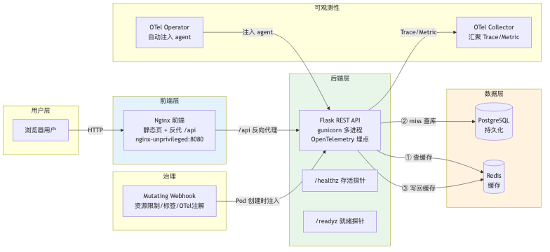
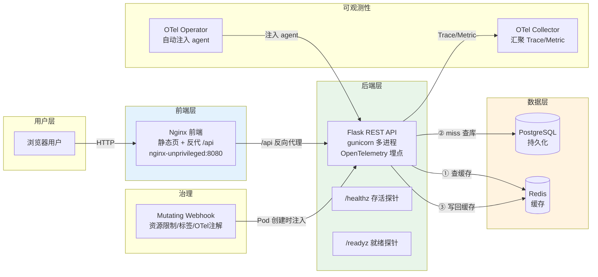

# 应用架构设计图

> 三层架构 + OpenTelemetry 可观测性 + Mutating Webhook 自动治理

## 架构图（PNG）



## 架构总览（Mermaid 源码）



## 三层职责

| 层 | 技术 | 职责 |
|----|------|------|
| **前端** | Nginx (unprivileged, 8080) | 静态页面 + `/api` 反向代理，避免跨域 |
| **后端** | Flask + gunicorn | REST API，缓存逻辑，健康检查 |
| **数据层** | PostgreSQL + Redis | 持久化 + 缓存 |

## 关键设计

### 1. 健康检查分离

- `/healthz`：存活探针，只检查进程存活
- `/readyz`：就绪探针，检查 DB + Redis 连通性

**为什么分离**：DB 挂了应该「摘流量」（就绪探针失败 → Service 不再转发），而不是「重启容器」（存活探针失败）。这是 K8s 生产实践的核心。

### 2. 缓存逻辑（数据流）

```
查商品列表 → 先查 Redis
  ├─ 命中 → 直接返回（source=cache）
  └─ miss → 查 PostgreSQL → 写回 Redis → 返回（source=database）
```

### 3. OpenTelemetry 自动注入

通过 Mutating Webhook 读镜像 OCI metadata label（`language=python`）自动识别 Python 应用，加 OTel 注入 annotation，交给 OTel Operator 注入 agent，实现无侵入可观测性。构建镜像时用 `LABEL language=python` 声明一次语言，部署时 webhook 自动发现，用户零感知。

### 4. 镜像优化

- 多阶段构建，后端镜像精简
- 非 root 运行（backend UID=1000，frontend nginx-unprivileged UID=101）
