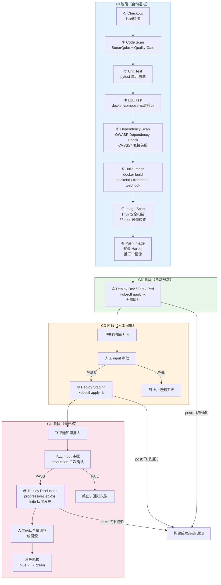

# CI/CD 流水线架构设计

> 由于没有harness，使用jenkins作为cicd工具，包括业务流水线的 11 个阶段
> 时间关系没有用argocd，jenkins完成ci和cd全部步骤
> 代码位置：根目录 `Jenkinsfile`（业务流水线）、`terraform/Jenkinsfile`（未完成）、`k8s/jenkins/values.yaml`（Jenkins 部署）

---

## 一、组件总览

| 组件 | 类型 | 代码位置 | 用途 |
|------|------|---------|------|
| **Jenkins Controller** | Helm Release | `k8s/jenkins/values.yaml` | 流水线控制器，常驻在 K8s `jenkins` namespace，NodePort 暴露 |
| **Jenkins Agent** | 动态 Pod | `Jenkinsfile` agent 段 | 每次构建临时创建，构建完销毁 |
| **业务流水线** | Declarative Pipeline | 根目录 `Jenkinsfile` | 代码扫描 → 测试 → 镜像构建/合规 → 分级部署（11 阶段） |
| **基础设施流水线** | Declarative Pipeline | `terraform/Jenkinsfile` | Terraform 校验 → plan → 审批 → apply（未完成） |
| **飞书通知** | Shell | `scripts/feishu-notify.sh` | 审批请求、部署结果、构建成败通知 |

---

## 二、流水线流程图（业务流水线 11 阶段）



---

## 二、Jenkins 部署方式

Jenkins Controller 用 Helm 部署在 K8s 里（`k8s/jenkins/values.yaml`）：

- 镜像：内网 Harbor `XXX.com/base/jenkins:lts-amd64`（构建节点无法访问 Docker Hub）
- 存储：`nfs-storage` StorageClass，20Gi 持久化
- 访问：NodePort（没有 LoadBalancer）
- 插件：kubernetes、git、docker-workflow、sonar、dependency-check-jenkins-plugin、kubernetes-cli、http_request等

```
Jenkins Controller（常驻）
    ↓ 触发构建时
创建临时 Agent Pod
    ├─ docker   容器：docker build / Trivy / docker-compose（挂 docker.sock）
    ├─ python   容器：pip install / pytest / sonar-scanner / update-image-tag.py
    ├─ kubectl  容器：kubectl apply -k 部署
    └─ jnlp     容器：checkout scm / git 写回（commit + push）
构建完成，销毁 Agent Pod
```

---

## 三、业务服务流水线（根目录 Jenkinsfile，11 个阶段）

| # | 阶段 | 运行容器 | 工具 | 说明 |
|---|------|---------|------|------|
| 1 | Checkout | jnlp | git | `checkout scm` |
| 2 | Code Scan | python | SonarQube | `withSonarQubeEnv('sonarqube')` + `waitForQualityGate`；`SKIP_SONAR=true` 显式跳过，配置缺失直接失败 |
| 3 | Unit Test | python | pytest | `pytest --cov` 单元测试 + 覆盖率，失败即中止 |
| 4 | E2E Test | docker | docker-compose | 拉起三层应用，验证 `/healthz`、`/readyz`、缓存链路（第一次 database、第二次 cache）；`SKIP_E2E=true` 显式跳过 |
| 5 | Dependency Scan | python | Dependency-Check | 扫 `requirements.txt`，`--failOnCVSS 7`（CVSS≥7 高危依赖直接失败），报告发布到 Jenkins UI |
| 6 | Build Image | docker | docker build | 构建 backend / frontend / webhook 三个镜像 |
| 7 | Image Scan | docker | Trivy + docker inspect | Trivy对镜像进行安全扫描 `--exit-code 1`；`docker inspect .Config.User` 检查用户为非 root |
| 8 | Push Image | docker | docker push | `harbor-credentials` 登录，推三个镜像到 Harbor |
| 9 | Deploy Dev/Test/Perf | 多容器 | kubectl + kustomize + git | `deployTo()`：结构化更新 newTag → `kubectl apply -k` → git 写回后部署，保持git和k8s资源一致性 |
| 10 | Deploy Staging | 多容器 | input | 飞书通知审批人 → `input` 人工审批 → `deployTo('staging')` → 飞书仅通知结果 |
| 11 | Deploy Production | 多容器 | input + Istio 灰度发布 | 飞书通知 → `input` 审批 → `progressiveDeploy()` |

`post` 块：构建成功/失败通过 `notifyFeishu()` 通知

---

## 四、基础设施流水线（terraform/Jenkinsfile，未完成）

| # | 阶段 | 说明 |
|---|------|------|
| 1 | Validate | `terraform fmt -check` + `terraform init -backend=false` + `terraform validate` |
| 2 | Plan | 切到目标环境 workspace（`terraform workspace select`，不存在则 new）+ `terraform plan -out=plan.tfplan` |
| 3 | Approval | 飞书通知审批人 + `input` 人工审批；production 环境**二次确认** |
| 4 | Apply | `terraform apply plan.tfplan`，完成后飞书通知 |

- 环境通过 `choice` 参数选择（dev/test/perf/staging/production）
- 阿里云 AK/SK 用 Jenkins credentials（`alicloud-access-key` / `alicloud-secret-key`）注入，不硬编码
- Terraform 运行在 Agent 的 terraform 容器（`hashicorp/terraform:1.5`）

---

## 五、镜像 tag 策略与 GitOps 写回

### 5.1 tag 策略

| 场景 | tag | 说明 |
|------|-----|------|
| CI 流水线构建 | `${GIT_COMMIT.take(8)}`（commit SHA 8 位） | 可追溯、不可变，三个镜像共用同一 commit SHA（Jenkinsfile environment 段） |
| overlay 基线（手动/基线部署） | dev/test = `latest-amd64`；perf/staging/prod = `v1-amd64` | k8s/overlays/*/kustomization.yaml 里定义 |
| 部署方式 | 脚本改 newTag → apply → git 写回 | 见下 |


---

## 六、与代码的对应关系

| 内容 | 代码文件 | 说明 |
|------|---------|------|
| 业务流水线 | 根目录 `Jenkinsfile` | 11 阶段 + GitOps 写回 + Istio 灰度 |
| 基础设施流水线 | `terraform/Jenkinsfile` | Validate → Plan → Approval → Apply |
| Jenkins 部署 | `k8s/jenkins/values.yaml` | Helm 部署镜像/插件/存储/NodePort |
| tag 更新脚本 | `scripts/update-image-tag.py` | 结构化更新 overlay 的 newTag |
| 飞书通知 | `scripts/feishu-notify.sh` | 飞书 webhook 发送 |
| Istio 灰度 | `k8s/istio/` | gateway / destinationrule / virtualservice（header 灰度） |
