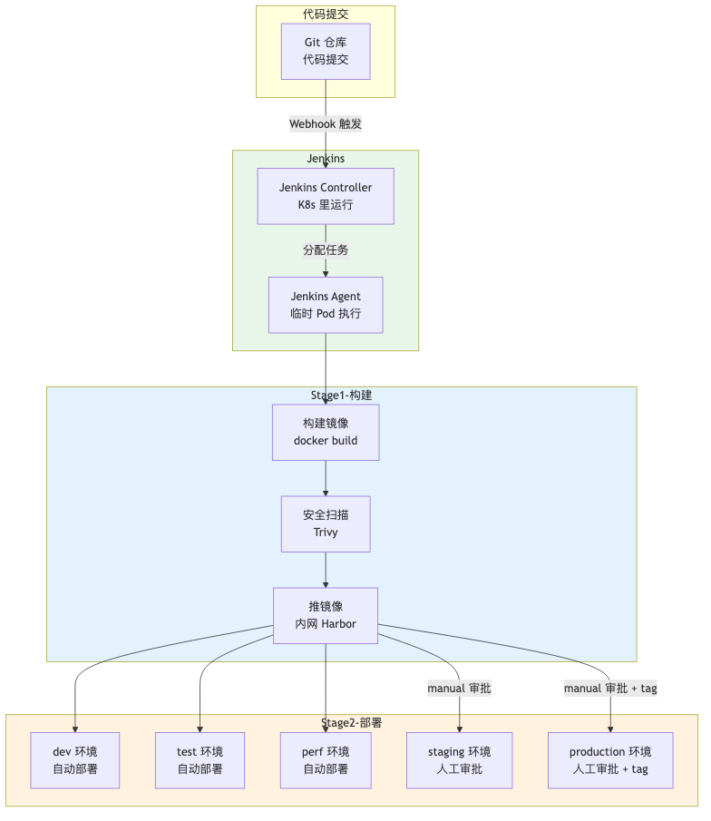
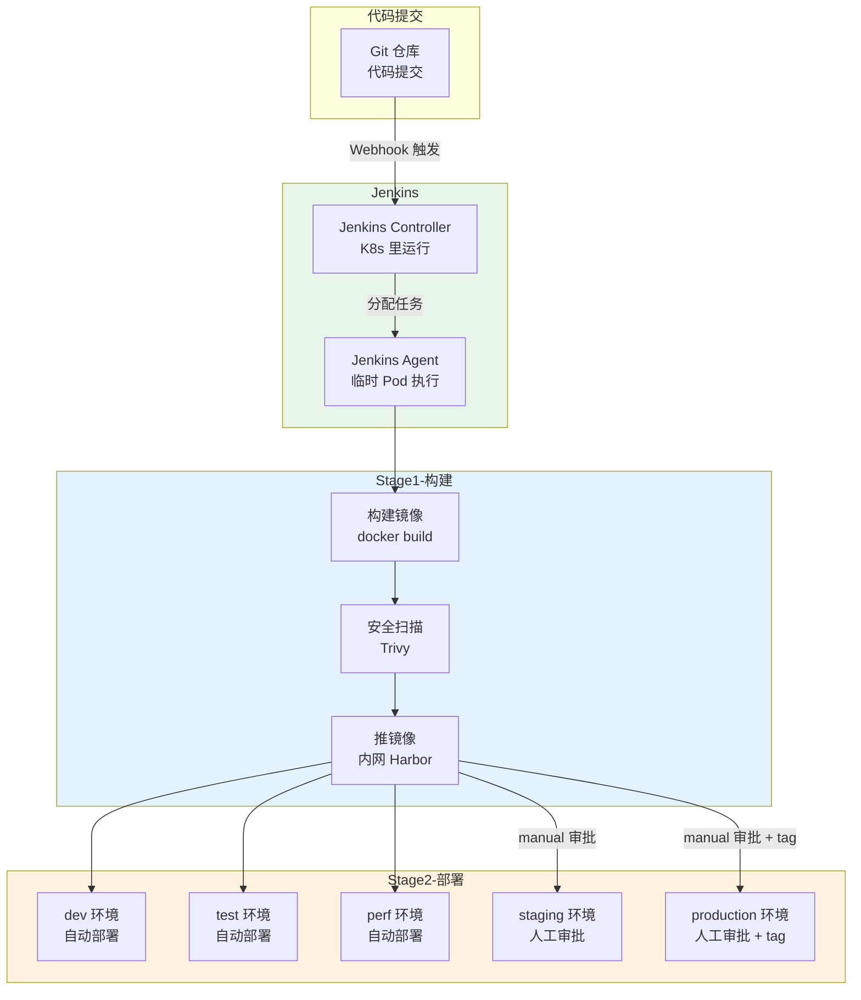

# CI/CD 流水线架构设计图

> Jenkins 流水线（部署在 K8s 里），分级发布：dev/test/perf 自动，staging/prod 审批

## 架构图（PNG）



## 架构总览（Mermaid 源码）



## Jenkins 部署方式（K8s 内）

Jenkins Controller 部署在 K8s 里（Helm 安装），每次构建动态创建一个临时 Agent Pod，构建完自动销毁：

```
Jenkins Controller（常驻）
    ↓ 触发构建时
创建临时 Jenkins Agent Pod
    ↓ 执行构建步骤（docker build / scan / push / kubectl apply）
构建完成，销毁 Agent Pod
```

**优势**：资源按需分配，构建任务隔离，不会互相影响。

## 分级发布策略

| 环境 | 触发方式 | 说明 |
|------|----------|------|
| dev / test / perf | 自动（代码合并触发） | 快速反馈 |
| staging | 人工审批（manual） | UAT 验收，需要人确认 |
| production | 人工审批 + tag | 生产最严格，只从 tag 发布 |

## 镜像 tag 策略

- 用 **commit SHA** 作为镜像 tag（可追溯、不可变），不用 latest（生产环境）
- dev/test 用 latest 快速迭代

## Jenkinsfile 结构（Declarative Pipeline）

业务服务流水线（`Jenkinsfile`）包含 **10 个阶段**：

```
pipeline {
  agent { kubernetes { ... } }    // K8s 动态 Agent

  stages {
    stage('Checkout')          { git 代码检出 }
    stage('Code Scan')         { SonarQube 代码静态扫描 }
    stage('Unit Test')         { pytest + 覆盖率 }
    stage('Dependency Scan')   { Dependency-Check 依赖漏洞 }
    stage('Build Image')       { docker build 三个镜像 }
    stage('Image Scan')        { Trivy 高危漏洞 + 非 root 检查 }
    stage('Push Image')        { 推内网 Harbor }
    stage('Deploy Dev/Test/Perf')  { 自动部署 }
    stage('Deploy Staging')        { 飞书通知 + 人工审批 }
    stage('Deploy Production')     { 二次审批 + 蓝绿部署 }
  }

  post { success/failure { 飞书通知 } }
}
```

基础设施流水线（`terraform/Jenkinsfile`）包含 **4 个阶段**：

```
Validate（fmt + validate）→ Plan（预览）→ Approval（人工审批）→ Apply（执行）
```

## 企业级合规检查（镜像合规）

在 `Image Scan` 阶段做了两层合规检查：

1. **Trivy 漏洞扫描**：扫描 HIGH/CRITICAL 级别漏洞，发现即构建失败（`--exit-code 1`）
2. **非 root 运行检查**：`docker inspect` 检查镜像 User 字段，以 root 运行即失败

## 蓝绿部署（Blue-Green，选做加分项）

生产环境部署用**蓝绿部署**，而不是直接替换：

```
blue（当前稳定版）  ──流量──▶  用户
                          ↑
green（新版本）  ──部署好等就绪──▶  切换 Service selector ──▶  流量切到 green

如果 green 异常 → 秒级切回 blue（自动回滚）
```

**步骤**：
1. 部署 green 版本（新镜像，独立 Deployment + `version: green` 标签）
2. `kubectl rollout status` 等 green 就绪（探针通过）
3. `kubectl patch service` 切换 selector 指向 green（流量瞬间切换）
4. 验证 green，异常则切回 blue（秒级回滚）

**优势**：零停机、秒级回滚，是生产级发布的标配。

## 金丝雀发布（Canary，用 Istio header 灰度，选做加分项）

用 Istio 的 VirtualService + DestinationRule 实现「按 header 定向灰度」，比副本数比例精确：

```
用户请求带 X-User-Group: beta → 路由到 v2（新版 green）
其他请求 → 路由到 v1（旧版 blue）
```

**灰度流程**：
1. 部署 green 新版（version=green 标签）
2. apply Istio 配置（DestinationRule 定义 v1/v2 子集 + VirtualService header 路由）
3. 测试组用户（带 header）先访问新版，观察无异常
4. 逐步放大流量权重（header 规则 → weight 权重 90/10 → 50/50 → 100%）
5. 全部流量切到新版，灰度完成

**Istio 配置文件在 `k8s/istio/`**：gateway.yaml + destinationrule.yaml + virtualservice.yaml

## 飞书通知

所有关键节点（审批请求、部署结果、构建成功/失败）都通过飞书 webhook 通知，脚本在 `scripts/feishu-notify.sh`。
