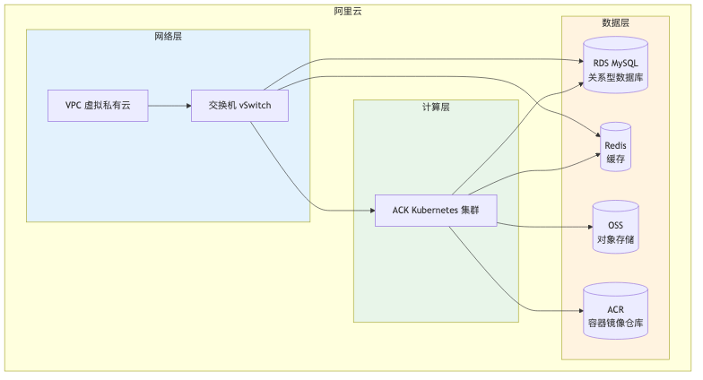
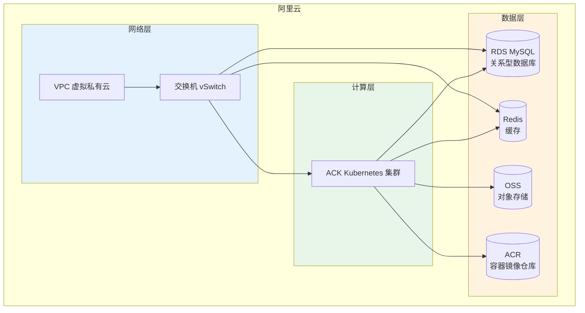

# 基础设施架构设计图

> 阿里云基础设施，Terraform 编排，5 套环境用 workspace 区分

## 架构图（PNG）



## 架构总览（Mermaid 源码）



## 环境隔离策略

5 套环境通过 **Terraform workspace** 区分，每套环境独立基础设施：

| 环境 | workspace | RDS 规格 | Redis 规格 | 用途 |
|------|-----------|----------|-----------|------|
| dev | dev | 最小规格 | 最小规格 | 开发 |
| test | test | 最小规格 | 最小规格 | QA 测试 |
| perf | perf | 中等规格 | 标准规格 | 压测 |
| staging | staging | 大规格 | 标准规格 | 预发布/UAT |
| production | production | 高可用规格 | 标准规格 | 生产 |

## Terraform 模块划分

```
terraform/
├── main.tf              # 主配置，调用各模块
├── variables.tf         # 变量定义
├── outputs.tf           # 输出（RDS/Redis/OSS 地址，供 K8s 引用）
├── environments/        # 5 套环境的 tfvars
│   ├── dev.tfvars
│   ├── test.tfvars
│   ├── perf.tfvars
│   ├── staging.tfvars
│   └── production.tfvars
└── modules/             # 模块化
    ├── vpc/             # 网络
    ├── rds/             # 关系型数据库
    ├── redis/           # 缓存
    ├── oss/             # 对象存储
    └── acr/             # 镜像仓库
```

## 安全设计

- RDS/Redis 白名单：`security_ips = var.vpc_cidr`（只允许 VPC 内网访问，不用 0.0.0.0/0）
- 生产环境 RDS 高可用：`category = HighAvailability`（多可用区）
- 敏感信息（db_password）通过 tfvars 或环境变量传入，不硬编码

## 使用方式

```bash
cd terraform

# 切换环境（用 workspace 区分）
terraform workspace new dev
terraform apply -var-file="environments/dev.tfvars"
```
